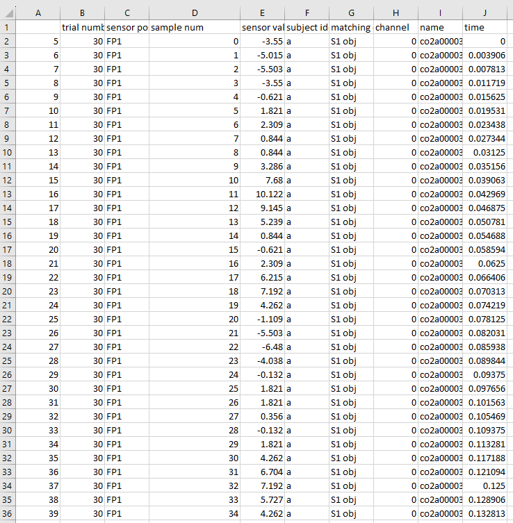

# EEG-Alcohol-ML-prediction
This project is based on sklearn machine learning models and a real-life training dataset to find possible ways to find if a person is alcoholic by reading their EEG signals.  
#### Dataset resource: [Kaggle](https://www.kaggle.com/datasets/nnair25/Alcoholics?resource=download), [Original](https://archive.ics.uci.edu/dataset/121/eeg+database).
## Data Set Information:
This data arises from a large study to examine EEG correlates of genetic predisposition to alcoholism. It contains measurements from 64 electrodes placed on subject's scalps which were sampled at 256 Hz (3.9-msec epoch) for 1 second.

There were two groups of subjects: alcoholic and control. Each subject was exposed to either a single stimulus (S1) or to two stimuli (S1 and S2) which were pictures of objects chosen from the 1980 Snodgrass and Vanderwart picture set. When two stimuli were shown, they were presented in either a matched condition where S1 was identical to S2 or in a non-matched condition where S1 differed from S2.
##### Attribute Information  
Each trial is stored in its own file and will appear in the following format.  
| trial number | sensor position | sample num | sensor value | subject identifier | matching condition | channel | name | time |  
| --- | --- | --- | --- | --- | --- | --- | --- | --- |

__Trail number__: the number order the record. E.g., 30 means this is the 30th trial for this participant.  

__sensor position__: The position of where the EEG signal is taken using 10-20 system. 64 in total. E.g., FP1, AFZ, POZ, etc.  

> Each electrode placement site has a letter to identify the lobe, or area of the brain it is reading from: pre-frontal (Fp), frontal (F), temporal (T), parietal (P), occipital (O), and central (C).  
>
> Even-numbered electrodes (2,4,6,8) refer to electrode placement on the right side of the head, whereas odd numbers (1,3,5,7) refer to those on the left; this applies to both EEG and EOG (electrooculogram measurements of eyes) electrodes, as well as ECG (electrocardiography measurements of the heart) electrode placement.  

__sample num__: the number order of when the signal is read during the trial. E.g., 128 means this is the 128th signal in this trial. Each trial has 256 sample numbers as the EEG frequency is 256 Hz.  

__sensor value__: the magnitude of EEG signal.  

__subject identifier__: 'a' for 'alcoholic', or 'c' for 'control'. Participants with 'a' identifier are alcoholic, and same applies to 'c'.

__matching condition__: which condition the participant was facing. S1 for a single image shown, S2 non-match for showing two different images, and S2 match for showing two identical images.  

__channel__: digitized category of sensor position. From 0 to 63.  

__name__: "name" of the participant, in a series of letters and numbers. E.g., co2a0000364.  

__time__: the specific timestamp of when the signal is read. From 0 to 1s.  

## Data processing
Here is a screenshot of a part of the dataset:  

The major problem here is how do we convert the raw data into a proper training and testing sets for our models.  
__Notice how each row is simply one signal data point in a trial for a participant.__  
 Intuitively, it is extremely hard to classify if a person is alcoholic by looking at one single EEG signal data in 1/256 second. It means that training with this unprocessed data will lead to huge bias and low accuracy. Thus, we want each record to have a full set of signal data of the entire trial for each participant.
